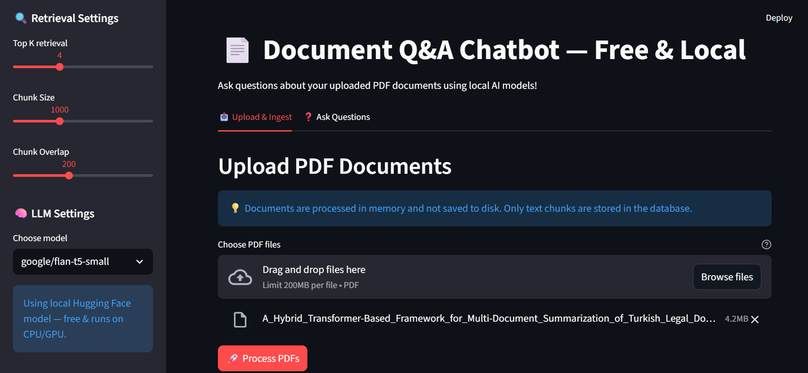

# 📄 Document Q&A Chatbot (Local RAG System)
A free, locally-running Document Question & Answer system using Retrieval-Augmented Generation (RAG). Upload PDF documents and ask questions about their content - all processing happens locally on your machine.
## ✨ Features
- **🔒 100% Local & Private**: No data leaves your machine
- **📄 PDF Support**: Process multiple PDF documents
- **🧠 Multiple AI Models**: Choose from various free Hugging Face models
- **📚 Collection Management**: Organize documents into collections
- **⚡ Fast Retrieval**: ChromaDB vector database for efficient searching
- **🎯 Configurable**: Adjust chunk sizes, retrieval parameters, and models

## 🚀 Quick Start
### Prerequisites

- **Python 3.8** or higher
- **4GB+ RAM** (8GB recommended for better performance)
- **2GB+ free disk space** for AI models
- **Stable internet** for initial model downloads
### 1. Installation
```bash
# Clone the repository
git clone <your-repo-url>
cd RAG_QNA_DOCS
# Create virtual environment (optional but recommended)
python -m venv .venv
source .venv/bin/activate  # On Windows: .venv\Scripts\activate
# Install dependencies
pip install -r requirements.txt


## MAIN INTERFACE




